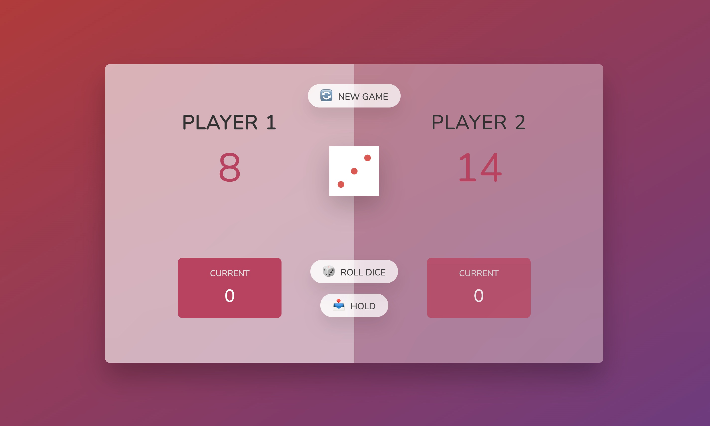
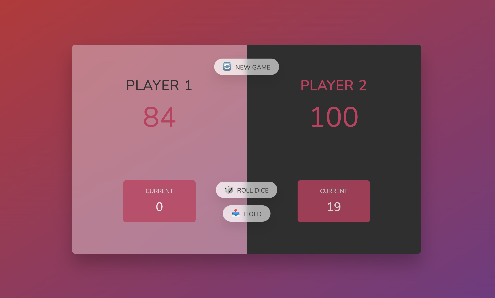

Pig Game

This is a two-player dice game where the winner is the player who reaches a total score of 100 first. Each time a player rolls the dice, the dice score is added to their current score. At any point, a player can click the 'Hold' button and their current score will be added to their total score. If the player rolls a 1, then the current score will be reset to 0, and it will be the other player's turn. The "New Game" button can be clicked at any point to reset the game.

The aim of this project was to write clean JavaScript code to handle the game logic, button functionality and CSS styling of the site.

## Table of contents

- [Overview](#overview)
  - [Screenshots](#screenshots)
  - [Links](#links)
- [My process](#my-process)
  - [Built with](#built-with)
  - [What I learned](#what-i-learned)
  - [Continued development](#continued-development)
- [Author](#author)

## Overview

### Screenshots

### Links

- Live Site URL: (https://mcddcm.github.io/pig-game/)

## My process

### Built with

- JavaScript
- Semantic HTML5 markup
- CSS custom properties

### Continued development

Future projects will focus on expanding basic JS logic and DOM methods. For example:

init()
=> bundle code to reset initial values

element.classList.add('hidden')
element.classList.remove('hidden')
element.classList.toggle('player--active');
=> add, remove, or toggle classes for styling of cards, buttons, modals, etc.

## Author

- Github - [@mcddcm](https://github.com/mcddcm)
